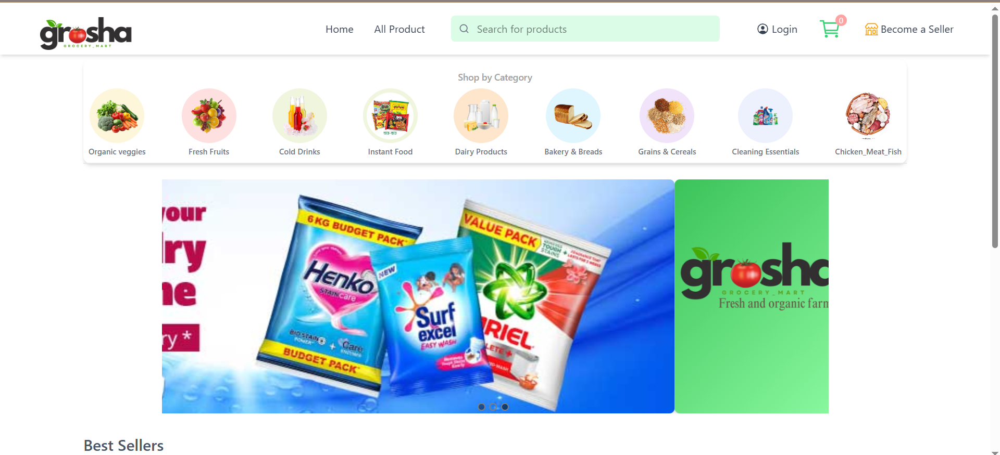
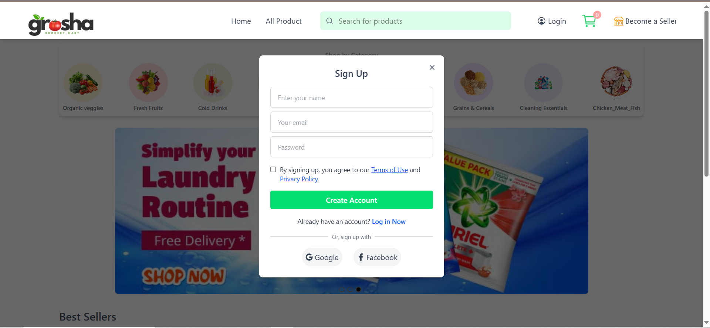
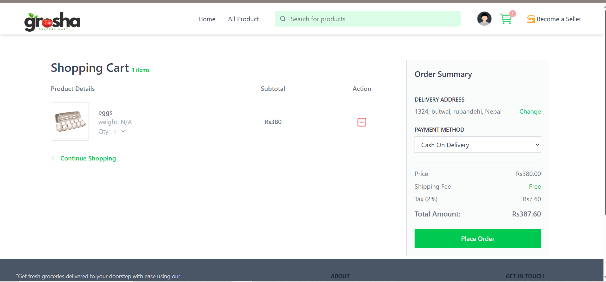
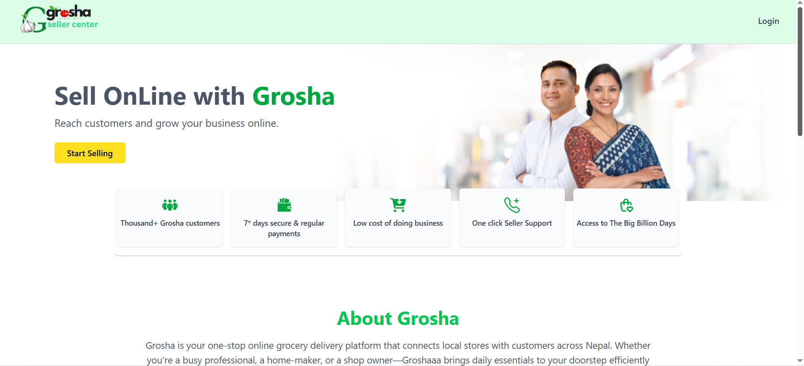
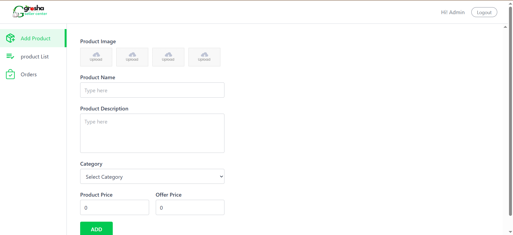
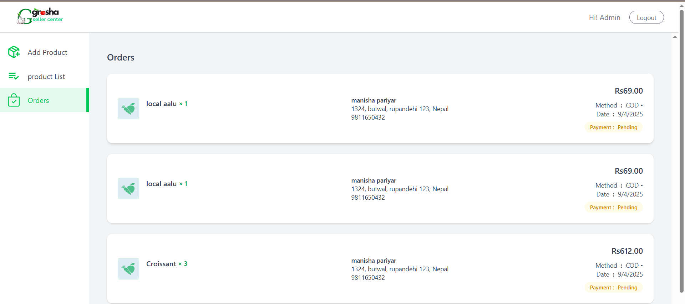
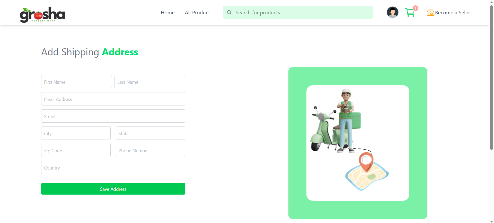

# 📦 Grocery Web App (Grosha)

A full-stack grocery shopping web application built with **React.js, Node.js, Express.js, MongoDB, TypeScript, and Tailwind CSS**.  
It allows users to browse groceries, manage their cart, place orders, and make secure payments.  

---

## 🚀 Features
- 🔐 **User authentication** (signup/login with JWT & OAuth)  
- 🛒 **Cart management** (add, update, and remove items)  
- 📦 **Order system** (place orders & view order history)  
- 💳 **Payment gateways** (Khalti, eSewa, Cash on Delivery)  
- 📱 **Responsive design** with Tailwind CSS  
- ⚡ **Backend API** built using Express.js & MongoDB  

---

## 🛠️ Tech Stack
- **Frontend:** React.js, TypeScript, Tailwind CSS  
- **Backend:** Node.js, Express.js  
- **Database:** MongoDB  
- **State Management:** React Context API  
- **Others:** Axios, Toast notifications, OAuth, Payment APIs  

---

## 📂 Project Setup  

### 1️⃣ Clone the repository
```bash
git clone https://github.com/manishapariyar/Grocery_Delivery.git
cd Grocery_Delivery
```
### 2️⃣ Install dependencies
  #### Frontend 
  ```bash
    cd frontend
    npm run dev
```
#### Backend
```bash
    cd backend
   npm start
   
 ```
    
###3️⃣ Setup environment variables
  Create a .env file in the backend folder and add the following:
   ```bash
   MONGO_URI=your_mongodb_connection_string
   JWT_SECRET=your_secret_key
   PAYMENT_API_KEY=your_payment_gateway_key
```
Now open your browser and go to:
👉 http://localhost:5173 for frontend
👉 http://localhost:5000 for backend


##📸 Screenshots

### Homepage
  

### Login
  

### All Product
  

 ### cart
  

 ### Individual Item
  

 ### Individual_Order
  

 ### Seller Home Page
  

 ### Add Product
  

 ### All Product
  

### Seller Order View
  

 ### Add Address
  